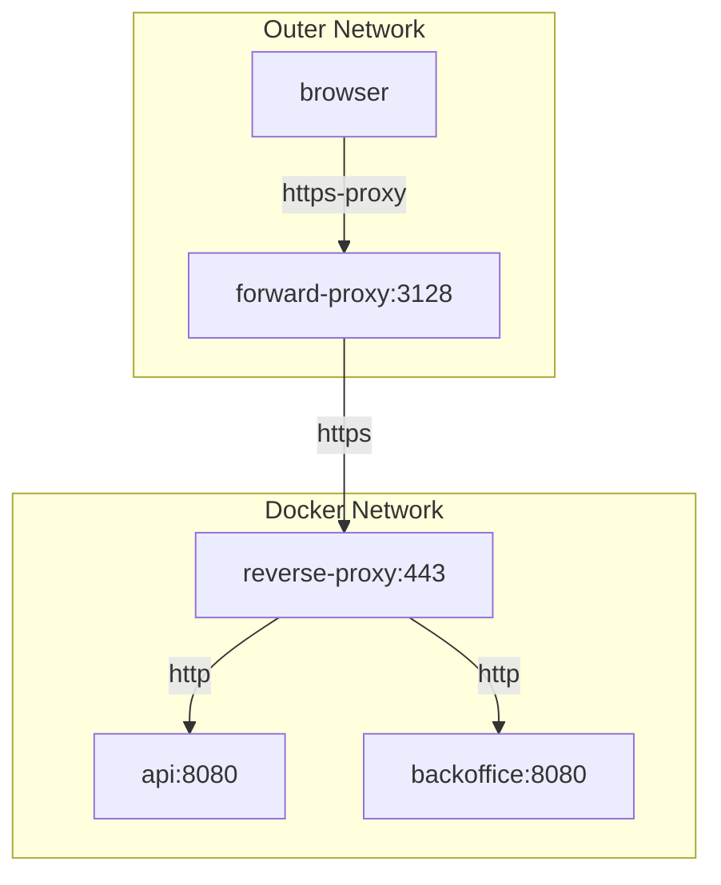

```mermaid
graph TD;
    subgraph Outer Network
        browser
        FP[forward-proxy:3128]
        browser -->|https-proxy| FP
    end
    
    subgraph Docker Network
        RP[reverse-proxy:443]
        API[api:8080]
        BO[backoffice:8080]
        
        FP -->|https| RP
        RP -->|http| API
        RP -->|http| BO
    end

```
