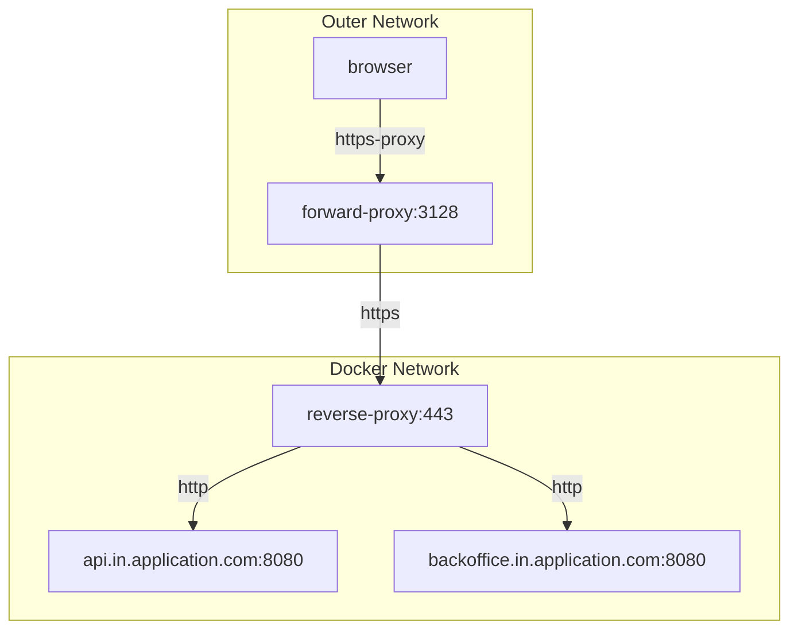

Here's a revised version of your text in American English:

## Use Case: Docker Network with Containers for Modularized Application Development

### Problem Statement
We have a modularized application composed of multiple components (e.g., API, back office) that communicate with each other via HTTP or HTTPS.

Externally, we want to access these components using production URLs over HTTPS.

As developers, we need to create a development environment that closely mirrors the production setup to effectively test our changes. Additionally, we aim to simplify network configuration, facilitate easier debugging, and enhance our development workflow.

### Proposed Solution
We propose using Docker to create a network of containers that simulate the production environment, incorporating both forward and reverse proxies to manage traffic between the components. The setup includes the following elements:

- **Examples of modules:** API, back office
- **Reverse proxy:** Handles incoming requests and routes them to the appropriate module
- **Forward proxy:** Forwards requests from the browser to the reverse proxy


The solution offers two setup variants: one with HTTP communication and another with HTTPS communication between the modules.

#### Communication between components via HTTP
Components communicate with each other over HTTP within the Docker network using urls with port number (e.g., `http://api.in.application.com:8080`).

#### Communication between components via HTTPS
Components communicate with each other over HTTPS within the Docker network using urls without port number (e.g., `https://api.in.application.com`), because communication is routed through the reverse proxy.

### Developer Access to the Application via Forward Proxy
Developers configure their browsers to use the forward proxy to access application modules using production URLs. The forward proxy forwards the requests to the reverse proxy, which then routes them to the appropriate module based on the URL path. Proxy configuration can be passed to the browser via environment variables.

It is recommended to use a separate browser profile to avoid conflicts with the default profile.

For example, in Linux:
```bash
mkdir -p /path/to/profile
https_proxy=http://${HOSTNAME}:3128 firefox --profile /path/to/profile
https_proxy=http://${HOSTNAME}:3128 google-chrome --user-data-dir=/path/to/profile
https_proxy=http://${HOSTNAME}:3128 curl https://api.in.application.com
```

For optimal convenience, it is recommended to import the Certificate Authority (CA) certificate generated for the reverse proxy into the browser's profile.

To avoid confusion between production and development environments, consider using a slightly different domain name for the development environment (e.g., `backoffice.in.application.com`) or differentiate the test version with color schemes or other visual cues. You can modify the color scheme within the browser's profile.

For example, in Firefox, you can set a color for panels in a CSS file as described in [this Stack Overflow post](https://stackoverflow.com/questions/78206548/firefox-124-how-to-change-background-color-of-active-tab-in-userchrome-css) or at [userchrome.org](https://www.userchrome.org/).

For two or more Docker network setups, you must use different ports for the forward proxy, but this involves changing only a single port in the configuration.

## ChatGpt opinion about the solution

This configuration offers several benefits to developers by simulating a production-like environment, facilitating easier development, testing, and debugging processes. Here's a detailed description of the advantages:

1. **Production-like Environment**:
    - **Realistic Testing**: Developers can test their changes in an environment that closely mirrors the production setup. This ensures that the application behaves as expected when deployed.
    - **Integration Testing**: Developers can run integration tests in an environment that simulates real-world interactions between different modules (api, backoffice) and the proxies.

2. **Simplified Network Configuration**:
    - **Consistent Access**: By configuring their browsers to use the forward proxy, developers can access the different modules using production URLs. This avoids the need for changing URLs or configurations when switching between development and production environments.
    - **Uniform Access Control**: The reverse proxy manages access to the api and backoffice modules, ensuring consistent access control and routing rules.

3. **Improved Development Workflow**:
    - **Easier Debugging**: The reverse proxy can be configured to log requests and responses, providing valuable insights during debugging. Developers can trace requests from the browser through the proxies to the application modules.
    - **Modular Development**: By isolating the api and backoffice modules within their own containers, developers can work on individual modules independently without affecting others. This modularity speeds up the development process and reduces the risk of breaking the application.

4. **Proxy Caching and Load Balancing**:
    - **Enhanced Performance**: The forward and reverse proxies can be configured to cache certain requests, reducing the load on the application modules and improving response times during development.
    - **Load Balancing**: Proxies can distribute incoming requests evenly across multiple instances of a module, simulating load balancing scenarios and ensuring that the application can handle traffic spikes effectively.

5. **Security and Isolation**:
    - **Isolated Development Environment**: The Docker network provides an isolated environment, preventing potential conflicts with other services running on the developer's machine.
    - **Secure Access**: Using HTTPS between the forward proxy and reverse proxy ensures secure communication, protecting sensitive data during development.

6. **Flexible Configuration**:
    - **Customizable Setup**: Developers can easily modify the configuration of the proxies and modules to test different scenarios or configurations. This flexibility is crucial for identifying potential issues and optimizing the application's performance and reliability.

By leveraging this Docker network setup with forward and reverse proxies, developers can create a robust, scalable, and secure development environment that closely mimics production, ultimately leading to higher quality software and more efficient development processes.
